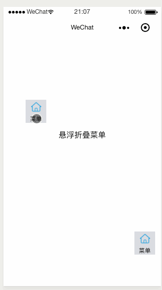

# 微信小程序可折叠菜单




1. 把components/menu文件拉入项目中


2. 在使用悬浮菜单的.wxml ,添加以下代码

	>bindmenuItemClick为按钮点击的时候的回调方法  mainmodel是显示的按钮，menulist为折叠的菜单的数组数据
 
	```
		<menu bindmenuItemClick="menuItemClick" mainmodel="{{mainmodel}}" menulist ="{{menulist}}" ></menu>

	```

3. 在.js里面实现方法
 
	```
	 ,menuItemClick:function(res){
	    console.log(res);
	    //获取点击事件的信息
	    let clickInfo = res.detail.iteminfo 
	    console.log(clickInfo);
	    // 根据不同类型进行判别处理
	    //事件的处理 代码

	  }
	```
完毕！
